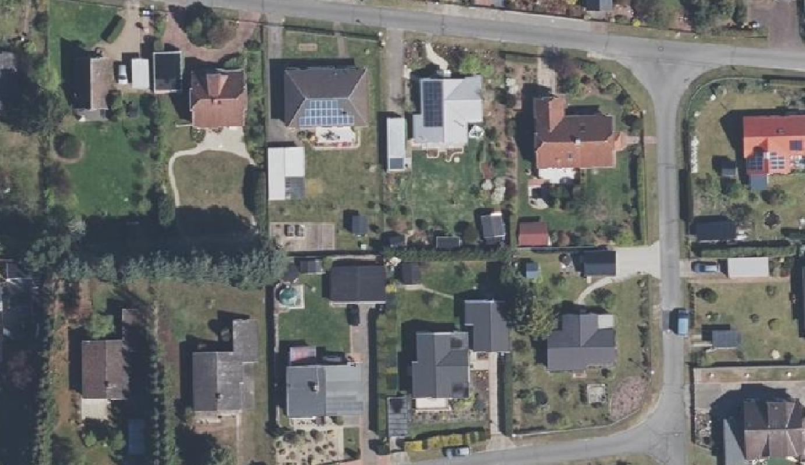

# Evaluation-of-Frame-Field-Learning-using-Orthophotos
This repository attempts to produce the results of the original work by Girard et.al. https://github.com/Lydorn/Polygonization-by-Frame-Field-Learning.
In this repository:
- The environment setup has been made simple by removing the hard coded versions from packages. 
- The training and inference has been made runnable by making changes within the code and debugging errors. 
- The model has been trained on a new dataset called the large scale real world dataset with data from Lower Saxony, Germany.

-----------------------------------------------------------------------------------------------------------------------------------------------------------------------
ENVIRONMENT SETUP
-----------------------------------------------------------------------------------------------------------------------------------------------------------------------

For setting up the environment use the 'environment.yml' file. Run the following in the terminal to create and activate the environment, here it is named frame_field. 

- conda init bash
- source .bashrc
- conda config --set channel_priority false
- conda env create -f environment.yml -p ~/frame_field
- conda activate /home/frame_field </the-complete-path-to-the-environment-created>

Takes .. minutes to create environment. This only needs to be done once.

After the environment is created, in order to activate it the next time just use:
- conda init bash
- source .bashrc
- conda activate /home/frame_field </the-complete-path-to-the-environment-created>

Change to the required directory: 
- cd Evaluation_of_Frame_Field_Learning_using_Orthophotos
-----------------------------------------------------------------------------------------------------------------------------------------------------------------------
DATASET
-----------------------------------------------------------------------------------------------------------------------------------------------------------------------
1. INRIA Aerial Dataset can be downloaded using the link from the original work:
https://github.com/Lydorn/Polygonization-by-Frame-Field-Learning

2. Large Scale Real World Dataset can be downloaded from the link below:
https://tubcloud.tu-berlin.de/s/M6PobTMpaX6q7Ap

Store the dataset in a folder called data and save the annotations and images in subfolders as below:
- data
  - PrivateDataset
    - raw
      - train
        - images
        - gt (binary masks)
        - gt_polygonized (geojson files)
        - gt_polygons (npy files)
      - test
        - images
        - gt_polygons (npy files)
        
Train on raw images from scratch:
The raw images are cropped into 725 x 725 patches and stored in a folder called processed which is created during the initial training. The calculation of tangent angle to be used as annotation for frame field is calculated during this step as well.

The path of data directory must be changed in 'configs/config.defaults.json' in 'data_dir_candidates'.

-----------------------------------------------------------------------------------------------------------------------------------------------------------------------
TRAINING
-----------------------------------------------------------------------------------------------------------------------------------------------------------------------
If inference is not sufficient and training wants to be performed, it can begin as below:

- python main.py --config configs/<name_of_config> --gpus 1
- python main.py --config configs/private_dataset_polygonized.unet_resnet101_pretrained --gpus 1

-----------------------------------------------------------------------------------------------------------------------------------------------------------------------
CONFIGURATIONS
-----------------------------------------------------------------------------------------------------------------------------------------------------------------------
There is one main configuration file for each of the datasets, namely:
1. inria_dataset_polygonized.unet_resnet101_pretrained
2. private_dataset_polygonized.unet_resnet101_pretrained

The parameters can be changed accordingly depending on the experiment one wants to perform. The other config files are all connected to the above two main files. The following parameters can be changed in order to perform the experiments explained in the paper.
1. CNN Network Backbone: In the respective main config file mentioned above, the 'default_filepath' can be changed in the 'backbone_params' parameters to any of the backbone_params.json provided. Also the 'encoder_depth' can be changed for changing the number of layers in the respective backbone.
2. Regularization: in configs/backbone_params.json: the value of dropout_2d can be changed to tweak the dropout value.
3. Hyperparameters: in configs/optim_params.json; the value for max_lr and base_lr can be changed for twaeking the learning rate.
4. Frame field parameters: in configs/config.defaults.json; when the compute_crossfield parameter is set to false, the frame field is not computed and simple segmentation takes place.
5. Segmentation parameters: in configs/config.defaults.json; in seg_params; when compute_edge is set to false, the exterior of the polygons is not considered during segmentation.

-----------------------------------------------------------------------------------------------------------------------------------------------------------------------
PRE-TRAINED MODEL
-----------------------------------------------------------------------------------------------------------------------------------------------------------------------
Once the data is uploaded, the inference can be run on any image using the pre-trained models.

Download the zipped pre-trained models and unzip them inside the folder frame_field_learning inside the subfolder runs.

The zip folder of the pre-trained models can be downloaded from here: 
- For INRIA dataset: https://drive.google.com/file/d/1bUuiJD148AbVU_GvRlcMNZZzSz3K3JG9/view?usp=sharing

- For Large scale real world dataset: https://drive.google.com/file/d/147BGJQdn95gj_Cro_A2MSFkEkG2-99_M/view?usp=sharing

1. Upload the zipped folder onto jupyter notebook (/frame_field_learning/runs).
2. Unzip it using the following:

- Fixes the zip file in case it is corrupted

  - !zip -FF inria_dataset_polygonized_unet_resnet101_pretrained_2022_05_10_10_05_30.zip -O private_dataset_polygonized_unet_resnet101_pretrained_2022_05_10_10_05_30.fixed.zip 

- Unzips the file and saves it in the same location
  
  - !unzip ~/Polygonization-by-Frame-Field-Learning/frame_field_learning/runs/private_dataset_polygonized_unet_resnet101_pretrained_2022_05_10_10_05_30.fixed.zip

3. Rename the file separating the name and datetime stamp with a '|' like so: 
  private_dataset_polygonized.unet_resnet101_pretrained | 2022_05_10_10_05_30
  
 This can be used as run_name during inference without the datetime stamp like so:
 
 - python main.py --in_filepath <path_to_image> --run_name  private_dataset_polygonized.unet_resnet101_pretrained

-----------------------------------------------------------------------------------------------------------------------------------------------------------------------
INFERENCE
-----------------------------------------------------------------------------------------------------------------------------------------------------------------------
The inference can be run on any image using the pre-trained models provided above or using a new run after training.

python main.py --in_filepath <path_to_image> --run_name <name_of_run>

python main.py --in_filepath /home/jovyan/Polygonization-by-Frame-Field-Learning/data/PrivateDataset/raw/test/images/bad_bodenteich3.tif --run_name private_dataset_polygonized_unet_resnet101_pretrained

Saves the predicted shapefiles in the same folder. In case the shapefiles are not saved, the config.json inside the runs folder can be changed to 'true' wherever necessary.

-----------------------------------------------------------------------------------------------------------------------------------------------------------------------
METRICS
-----------------------------------------------------------------------------------------------------------------------------------------------------------------------
The IoU and tangent angle metrics can be evaluated for each image as below using the image and ground truth shapefile:

1. change directory to scripts: cd scripts

2. python eval_shapefiles.py --im_filepath <path_to_image> --gt_filepath <path_to_gt_shapefile> --pred_filepath <path_to_predicted_shapefiles>
  - python eval_shapefiles.py --im_filepath ~/Polygonization-by-Frame-Field-Learning/data/PrivateDataset/raw/test/images/bad_bodenteich3.tif --gt_filepath ~/Polygonization-by-Frame-Field-Learning/data/PrivateDataset/raw/test/shp/bad_bodenteich3.shp --pred_filepath ~/Polygonization-by-Frame-Field-Learning/data/PrivateDataset/raw/test/images/poly_shapefile.simple.tol_1/bad_bodenteich3.shp
  
3. Run check.py to get the average values of IoU and tangent angle for each image.

-----------------------------------------------------------------------------------------------------------------------------------------------------------------------
TENSORBOARD
-----------------------------------------------------------------------------------------------------------------------------------------------------------------------
The logs that are saved inside the runs folder can be used to track the training process and the graphs for loss and some predictions can be viewed on tensorboard through the following way:

1. Create a virtual environment on your local machine eg. virtual_env.
2. On your command prompt change directory to the virtual_env.
3. Activate it using 'Scripts/activate.bat'; now we are inside the virtual environment.
4. Change directora to where the logs are saved.
5. Then type: tensorboard --logdir=<name_of_log>
6. Let it run until it displays a local host link like so: http://localhost:6006/. Run this link in the browser to access the data inside the tensorboard.

-----------------------------------------------------------------------------------------------------------------------------------------------------------------------
RESULTS
-----------------------------------------------------------------------------------------------------------------------------------------------------------------------
The results on INRIA dataset can be seen below where a building with hole in the city of Innsbruck is well polygonized, followed by a series of attached building in SanFrancisco which are polygonized somewhere in cluster and not separately as wanted.

   

   

The results for large scale real world dataset can be seen below where a building with sharp edges in the city of Uelzen has been well polygonized, followed by a series of single standing buildings in Bad bodenteich which are polygonized well as well. Another building from Uelzen has been shown where the curve of the building is well polygonized while obstruction due to the shadow of a tree leads to improper polygonization.

   

   

   

